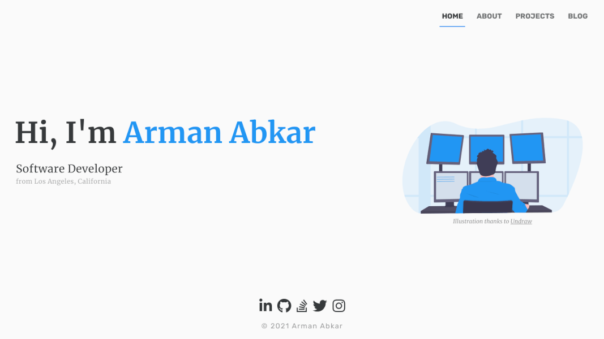
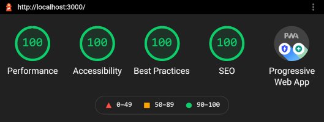

# Sapper Blog

A starter template for building markdown-powered blogs with [Sapper](https://github.com/sveltejs/sapper) and [Svelte](https://github.com/sveltejs/svelte).

## Preview

### 👉 [Live Demo](https://armanabkar.ir/)

<h2 align="center">
  
  <br>
</h2>

<h2 align="center">
  
  <br>
</h2>

## ⚡ Features

- [x] Responsive & Lightweight
- [x] Markdown-based Personal Blog 
- [x] Portfolio
- [x] Personal Projects Page
- [x] Pagination for blog and projects
- [x] Highly Customizable
- [x] Dark Mode
- [x] Animations & Transition
- [ ] Contact Form

## ✨ Getting started

```bash
git clone https://github.com/armanabkar/sapper-blog-template.git
cd sapper-blog-template
npm install # or yarn!
npm run dev
```

Open up [localhost:3000](http://localhost:3000) and start clicking around.

Consult [sapper.svelte.dev](https://sapper.svelte.dev) for help getting started.

## 🖌 Styles

You can modify styles in static/global.css file:

```css
:root {
  --primary: #607d8b;
  --secondary: #1d2930;
  --tertiary: #8eacbb;
  --background: #f0f3f5;
}
```

And dark mode's theme in src/components/ThemeToggle.svelte:

```css
:global(body.dark-mode) {
  --primary: #607d8b;
  --secondary: #f0f3f5;
  --tertiary: #8eacbb;
  --background: #252525;
}
```

## 🏗 Structure

The base structure of this template is the same as Sapper's [default template](https://github.com/sveltejs/sapper-template/). These are some of the new things you'll find here:

### src/routes/blog

This is the home of your blog. The most important files in here are:

- `_posts.js`: this module contains the logic for loading and parsing your markdown posts.
- `[slug].svelte`: this is the template of your blog post page.
- `index.svelte`: this is the template of your article list page.

### src/content/posts

This is where your markdown posts live in. All `.md` files in this directory are treated as blog posts and parsed automatically by the `_posts.js` module.

- The markdown file name becomes the post slug. For example `hello-world.md` becomes `http://localhost:3000/blog/hello-world`.
- Everything between the start of the post and the `<!-- more -->` tag becomes the article's "excerpt".
- Frontmatter properties supported are `title` and `date`.

### src/routes/projects.svelte

This is your projects page. You can add your projects information to projects array in src/information.js module.

## ℹ️ Information

You can edit all the personal information and projects in src/information.config.js module.

```js
export const Information = {
  name: "Lorem Ipsum",
  profilePicture: "profile-pic.png",
  position: "Lorem Ipsum",
  location: "Lorem, Ipsum",
  about: [
    "Qui mollit et irure ea veniam amet. Labore ex incididunt.",
  ],
  skills:
    "lorem, ipsum",
  experiences: [
    {
      position: "Lorem Ipsum",
      company: "Lorem Ipsum",
      location: "Lorem, Ipsum",
      date: "Sep 2020 - Present",
    },
  ],
  phone: "+98 999 999 9999",
  email: "loremipsum@loremipsum.com",
  socialMedia: {
    LinkedIn: "https://www.linkedin.com/in/loremipsum/",
  },
  projects: [
    {
      name: "Lorem Ipsum",
      description: "Qui mollit et irure ea veniam amet. Labore ex incididunt.",
      imageUrl:
        "loremipsum.png",
      code: "https://loremipsum.com",
      live: "https://loremipsum.ir",
    }],
};
```

## 🐛 Bugs and feedback

Sapper is in early development, and may have the odd rough edge here and there. Please be vocal over on the [Sapper issue tracker](https://github.com/sveltejs/sapper/issues).
